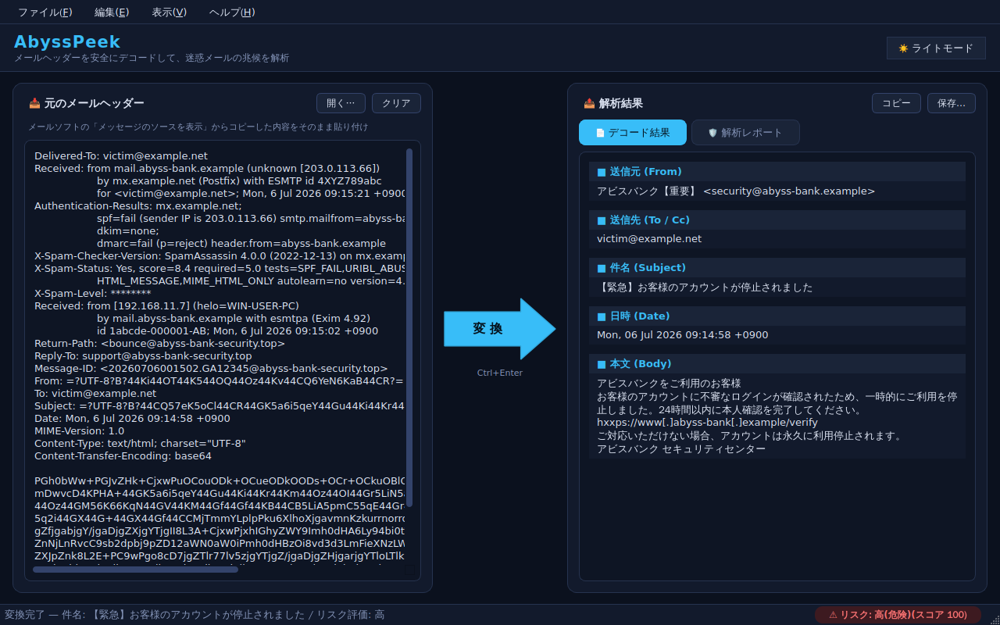
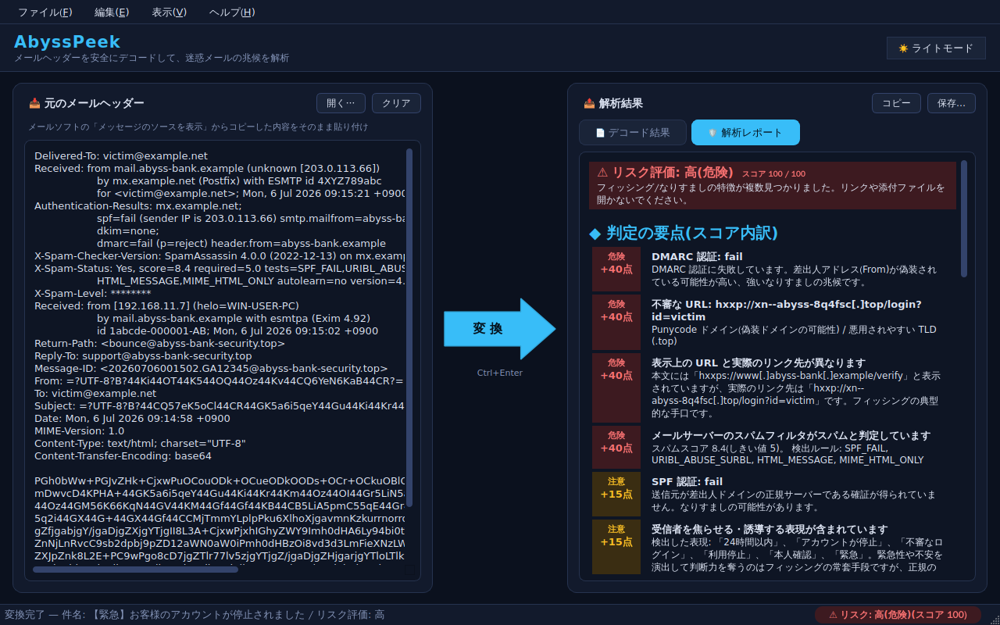
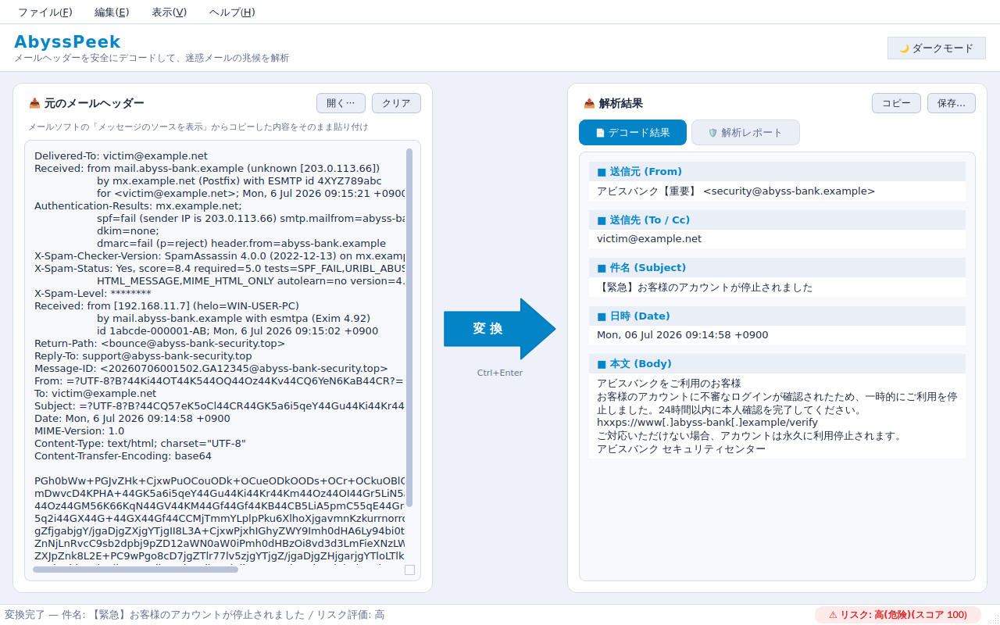
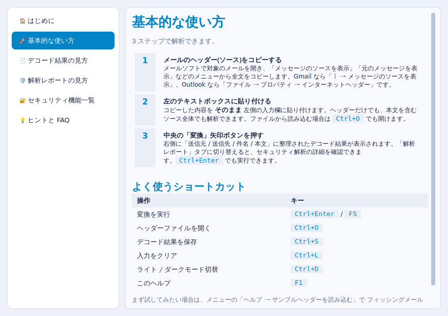

# AbyssPeek

[](https://github.com/DepthNekobit/AbyssPeek/releases/latest)
[](https://github.com/DepthNekobit/AbyssPeek/actions/workflows/test.yml)
[](LICENSE)


**迷惑メールの深淵を、安全な場所から覗き込む。**

AbyssPeek は、怪しいメールのヘッダー(メッセージのソース)を貼り付けるだけで、
エンコードされた件名・差出人・本文を読める形にデコードし、フィッシング・なりすましの
兆候を自動解析するデスクトップツールです(PySide6 製 GUI)。



## 特徴

- 🖥️ **GUI 操作** — 左のテキストボックスにヘッダーを貼り付け、中央の矢印型「変換」ボタンを
  押すだけ。右側に整理された結果が表示されます
- 🌗 **ライト / ダークモード** — ワンクリックで切り替え(設定は自動保存)
- 📄 **区分表示** — デコード結果を「送信元 / 送信先 / 件名 / 日時 / 本文」に整理して出力
- 🛡️ **セキュリティ解析レポート** — リスクスコア付きの総合判定
- 🔒 **完全ローカル処理** — 貼り付けた内容を外部に送信せず、URL への接続や DNS 参照も
  一切行いません(解析したことが攻撃者に知られません)
- 📚 **内蔵ヘルプ** — サイドメニュー付きの使い方ガイド(F1)



## セキュリティ解析でチェックする項目

| カテゴリ | 内容 |
|---|---|
| 送信ドメイン認証 | 受信経路と発行元が一致する Authentication-Results の SPF / DKIM / DMARC 結果を評価。信頼できる認証結果が無い場合も減点 |
| 差出人の偽装 | 名義とアドレスの不一致、公式に酷似したドメイン(`amaz0n`/`paypa1` 等のホモグリフ)、ランダムな使い捨てアドレス、フリーメールでの組織なりすまし |
| 配送経路・通過地域 | Received ホップの一覧化、**IP から推定した通過地域(国・大陸)とクラウド事業者名**、推定送信元、配送時刻の矛盾検出 |
| 本文の URL | 表示 URL とリンク先のすり替え、Punycode / IP 直指定 / 短縮 URL(50+ サービス)/ 無料・一時ホスティング / ダイナミック DNS / 悪用 TLD |
| HTML 攻撃 | 本文内スクリプト・外部送信フォーム・meta refresh 自動転送・iframe |
| 添付ファイル | 実行形式・マクロ付き文書・二重拡張子 (`invoice.pdf.exe`) の警告 |
| 迷惑メール内容 | 金銭・射幸・アダルト等の勧誘語、過剰な記号、高額表示などから本文自体のスパム度を独自判定(X-Spam ヘッダー非依存) |

検出結果はリスクスコア (0–100) に集計され、「問題なし / 低 / 中 / 高」で総合判定されます。
**レポートは各項目の加点(+○点)を明示**するので、どの理由でその評価になったかが分かります。
通過地域の推定は IANA/RIR の割当データを内蔵しオフラインで行い、外部通信はしません。
本文中の URL は誤クリック防止のため `hxxps://example[.]com` 形式に無害化(defang)して表示します。



## ダウンロード (Windows)

[**Releases ページ**](https://github.com/DepthNekobit/AbyssPeek/releases/latest) から
`AbyssPeek.exe`(単一ファイル版)をダウンロードして、そのまま実行できます。
Python のインストールは不要です。

> [!NOTE]
> コード署名をしていないため、初回起動時に Windows SmartScreen の警告が出ることがあります。
> 「詳細情報 → 実行」で起動できます。初回は展開処理のため起動に数秒かかります。

exe はタグ (`v*`) のプッシュを契機に GitHub Actions(`.github/workflows/release.yml`)が
Windows ランナー上でビルドし、Releases に自動添付しています。

## ソースからの起動

Python 3.11 以上が必要です。PySide6 が動作する環境であれば、Windows 以外
(macOS / Linux)でもソースから起動できます。

```bash
git clone https://github.com/DepthNekobit/AbyssPeek.git
cd AbyssPeek
python -m venv .venv
# Windows: .venv\Scripts\activate / macOS・Linux: source .venv/bin/activate
pip install -r requirements.txt
python main.py
```

自分で exe 化する場合は、同梱の `.ico` をそのまま使えます。

```bash
pip install -r requirements-build.txt
pyinstaller --noconsole --onefile --icon assets/icon/abysspeek.ico --add-data "assets;assets" --add-data "LICENSE;." --add-data "THIRD_PARTY_NOTICES.md;." --add-data "licenses;licenses" main.py
```

## 使い方

1. メールソフトで対象メールの「メッセージのソースを表示」(Gmail: ︙ → メッセージのソースを表示、
   Outlook: ファイル → プロパティ → インターネットヘッダー)から全文をコピー
2. 左のテキストボックスに貼り付け(`Ctrl+O` でファイルからも読み込み可)
3. 中央の **変換** ボタン(`Ctrl+Enter` / `F5`)を押す
4. 右側の「デコード結果」タブで内容を、「解析レポート」タブで危険度を確認

まず試したい場合は、メニューの **ヘルプ → サンプルヘッダーを読み込む** で
フィッシングメールを模したサンプルを読み込めます。詳しい使い方はアプリ内ヘルプ(`F1`)を
参照してください。



## レイアウトについて

入力と出力のテキストボックスは**左右配置**を採用しています。翻訳ツールなど「変換」系 UI の
慣習に沿っており、右向きの矢印ボタンで処理の流れが直感的に伝わること、ワイド画面で
縦スクロールの長いヘッダーと結果を並べて見比べられることが理由です。

## プロジェクト構成

```
AbyssPeek/
├── main.py                     # エントリポイント
├── THIRD_PARTY_NOTICES.md      # サードパーティのライセンス表記
├── licenses/                   # LGPLv3 / GPLv3 の全文
├── assets/
│   ├── sample_header.txt       # デモ用サンプル(フィッシング風・架空ドメイン)
│   └── icon/                   # アプリアイコン (PNG 各サイズ / Windows 用 .ico)
├── tools/
│   ├── generate_icon.py        # アイコン画像の再生成スクリプト
│   └── generate_geoip_table.py # IPv4 /8 地域テーブルの再生成スクリプト
├── src/
│   ├── io/file_handler.py      # ファイル入出力(文字コードフォールバック付き)
│   ├── services/
│   │   ├── mail_decoder.py     # MIME / 文字コードのデコード
│   │   ├── spam_analyzer.py    # X-Spam-Status 等の読み取り
│   │   ├── security_analyzer.py# セキュリティ解析(認証・経路・URL・添付)
│   │   ├── geoip.py            # オフラインの簡易 IP 地域推定
│   │   └── output_formatter.py # 送信元/送信先/件名/本文の整形
│   ├── usecases/analyze_mail.py# 解析パイプライン
│   └── gui/                    # PySide6 GUI(テーマ / レポート / ヘルプ)
├── tests/                      # 回帰テスト (unittest)
└── .github/workflows/          # CI(テスト)と Windows 版リリースビルド
```

## 開発

テストは標準ライブラリの `unittest` で実行できます(GUI 関連のテストには PySide6 が必要です)。

```bash
python -m unittest discover -s tests -v
```

プッシュ / プルリクエストごとに GitHub Actions で Python 3.11 / 3.12 のテストが走ります。

## 注意事項

- 「問題なし」は**既知の危険パターンが見つからなかった**ことを意味し、安全の保証ではありません
- Received ヘッダーの送信者側は偽造可能なため、推定送信元は参考情報です
- 本ツールはウイルス対策ソフトの代替にはなりません

## 不具合報告・要望

不具合や判定ミス(誤検知・見逃し)の報告、機能の要望は
[Issues](https://github.com/DepthNekobit/AbyssPeek/issues) へお寄せください。

> [!WARNING]
> 実際に受信したメールのヘッダーには、あなたや受信者のメールアドレス・IP アドレス・
> 利用しているサーバー名などが含まれます。Issue に貼り付ける場合は、該当部分を
> `example.com` などに置き換えてから投稿してください。

## ライセンス

本プロジェクトのソースコードは [MIT License](LICENSE) で公開しています。

GUI フレームワークとして [PySide6 (Qt for Python)](https://doc.qt.io/qtforpython-6/) を
**LGPLv3** の条件で利用しており、配布物(exe)には PySide6 / Qt のバイナリが含まれます。
本アプリのソースコードは本リポジトリで全て公開されているため、LGPL が求める
ライブラリの差し替え・再ビルドはソースから自由に行えます。

同梱しているサードパーティ製ソフトウェア・データのライセンスと入手先は
[THIRD_PARTY_NOTICES.md](THIRD_PARTY_NOTICES.md) にまとめています(ライセンス全文は
[`licenses/`](licenses))。配布 zip にも同じ文書を同梱しており、アプリ内の
「ヘルプ → サードパーティ ライセンス」「ヘルプ → Qt について」からも確認できます。

通過地域推定用の IPv4 /8 テーブルは、RIR の割当統計を国別に集約した
[ipverse/country-ip-blocks](https://github.com/ipverse/country-ip-blocks)(CC0)から
`tools/generate_geoip_table.py` で生成しています。
